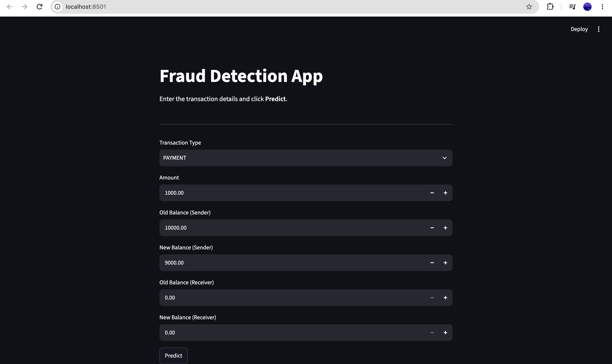

# Fraud Detection System

A machine learning-based financial fraud detection system built using Python, Scikit-learn, and Streamlit.

The system takes transaction details as input and predicts whether the transaction is likely to be fraudulent or legitimate.

## Project Overview

Financial fraud detection is a binary classification problem where the goal is to identify suspicious transactions while minimizing incorrect predictions.

This project uses the PaySim financial transaction dataset and a Logistic Regression model to classify transactions.

## Features

The application accepts the following transaction details:

- Transaction type
- Transaction amount
- Sender's old balance
- Sender's new balance
- Receiver's old balance
- Receiver's new balance

Two additional features are engineered from the balance information:

- `balanceDiffOrig`
- `balanceDiffDest`

## Machine Learning Pipeline

The project uses a Scikit-learn Pipeline consisting of:

1. Data preprocessing using `ColumnTransformer`
2. Numerical feature scaling using `StandardScaler`
3. Categorical encoding using `OneHotEncoder`
4. Logistic Regression classifier

The trained pipeline is saved using Joblib and loaded directly by the Streamlit application.

## Feature Engineering

The following features are calculated:

```text
balanceDiffOrig = oldbalanceOrg - newbalanceOrig

balanceDiffDest = newbalanceDest - oldbalanceDest

## Application Screenshots

### Main Application



### Legitimate Transaction


